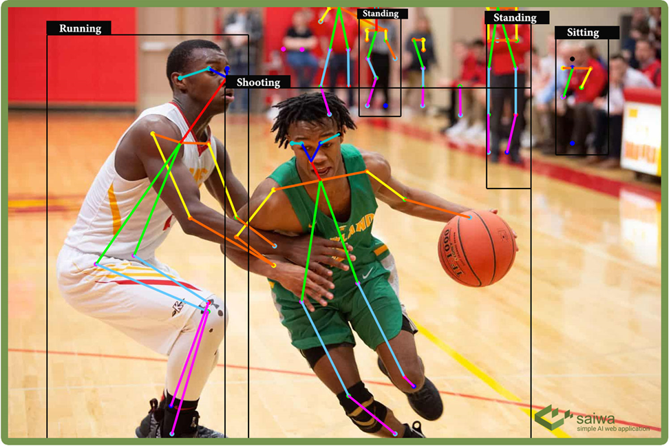

# PoseFinder: Human Pose Estimation iOS App

## Overview
PoseFinder is an iOS application that leverages Core ML and Vision frameworks to perform real-time human pose estimation using the PoseNet model. The app detects and visualizes human body joints (keypoints) in images or live camera feeds.

 

## Project Structure

### ios_deployment
- **Configuration**: Deployment settings for PoseNet
- **Documentation**:
  - `PoseNetPipeline.png` - Architecture diagram
  - `PoseNetVisualization.png` - Example output

### PoseFinder [(Main App)](https://developer.apple.com/documentation/coreml/detecting-human-body-poses-in-an-image)
- **App**:
  - `Assets.xcassets` - App icons and images
  - `Base.lproj` - Localized storyboards
  - `LaunchScreen.storyboard` - Launch screen
  - `Main.storyboard` - Primary UI
  - `AppDelegate.swift` - App lifecycle
  - `Info.plist` - Configuration

### Extensions+Types
- `CGImage+Extension.swift` - Image manipulation
- `CGPoint+Extension.swift` - Point calculations

### Model
- `PoseNet.swift` - Core ML wrapper
- `PoseNetInput.swift` - Input preprocessing
- `PoseNetMobileNet075S16FP16.mlmodel` - [Pretrained model](https://github.com/google-coral/project-posenet)
- `PoseNetOutput.swift` - Output processing

### Pose
- `Joint.swift` - Keypoint structure
- `Pose.swift` - Pose representation
- `PoseBuilder.swift` - Pose construction
  - `+Single.swift` - Single-person
  - `+Multiple.swift` - Multi-person
  - `Configuration.swift` - Settings

### UI
- `ConfigurationViewController.swift` - User settings
- `GradientOverlayView.swift` - Visual overlay
- `PopOverModalViewController.swift` - Dialogs
- `PoseImageView.swift` - Keypoint display

## Features
- ✅ Real-Time Pose Estimation (17 keypoints)
- ✅ Single & Multi-Person Detection
- ✅ Camera & Image Input
- ✅ Custom Visualization
- ✅ Optimized for iOS (Core ML)

### Prerequisites
- Xcode 12+
- iOS 14+
- A12+ chip recommended

## Demon

| Feature | Preview |
|---------|---------|
| **Pose Estimation** |  |

